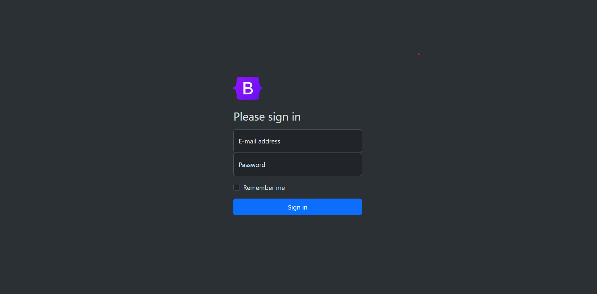

# Bootstrap Login Page Project

This project comprises a simple login page implemented using the Bootstrap framework version 5.3.2. The page is designed to be responsive and features a dark theme. The login form includes fields for the email address, password, and an option to remember the user.

## Prerequisites

Ensure you have the following resources before running the project:

- [Bootstrap 5.3.2](https://getbootstrap.com/)

## Project Structure

The project is structured as follows:

- `index.html`: Contains the HTML structure of the login page.
- `style.css`: Custom style sheet to enhance the design.

## Usage Instructions

1. Download the project or clone it to your local environment.
2. Make sure to include the Bootstrap CSS file in your application using the link provided in the `index.html` file.
3. Replace the content of the `src` attribute in the `img` tag with the appropriate path for the provided desktop image (`assets/desktop.png`).
4. Customize the form as needed to meet the requirements of your project.

## Demo

*The image above showcases the appearance of the login page.*